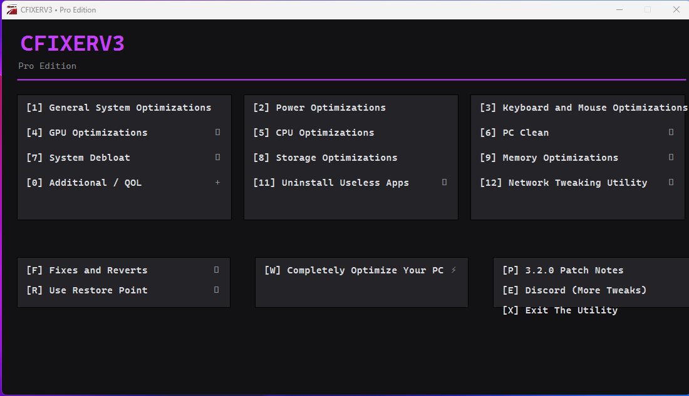

# CFIXER V3 Pro Edition
Pro edition of my standard CFIXERV3, with new UI, new fixes, reworked code.

## New UI Re-Work
- Options are now clickable
- Added animations
- Neon UI
- Auto-Elevate UAC
- Keyboard controlled options

### New log file system
- The app logs every thing it do after a task/exitapp __(located in C:\ProgramData\CFIXERV3\logs)__
- Dynamic log

#### ⚙️ Features
- General System Optimizations
- GPU Optimizations
- System Debloat
- Additional / QOL Features
- Power Optimizations
- CPU Optimizations
- Storage Optimizations
- Uninstall Useless Apps
- Keyboard and Mouse Optimizations
- PC Cleaning
- Memory Optimizations
- Network Tweaking Utility
- Fixes and Reverts
- Use Restore Point

